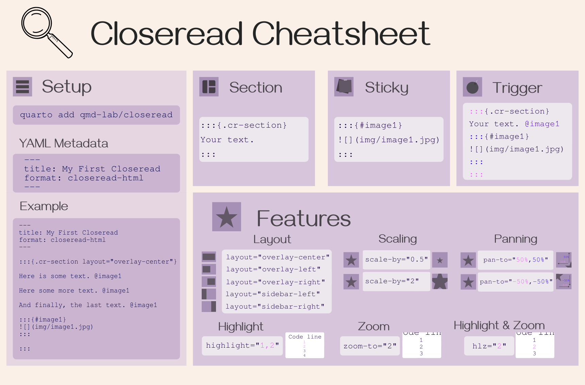

## Scrollytelling Science with Quarto and Closeread

This repo contains everything used in my R-Ladies presentation **"Scrollytelling Science with Quarto and Closeread"**, including the slides and a working Closeread example you can fork and modify for your own projects.

------------------------------------------------------------------------

## 📂 Repo Structure

``` text
R-Ladies-Closeread/
├── R-Ladies-Closeread.Rproj           # RStudio project for the main presentation
├── index.qmd                          # Quarto Reveal.js slide deck
├── index.html                         # Rendered presentation (can open in browser)
├── style.scss                         # Custom Reveal.js slide styling
├── images/                            # Images used in the slides
│
├── Closeread_example/                 # Self-contained scrollytelling demo
│   ├── Closeread_example.qmd          # A minimal Closeread example
│   ├── Closeread_example.html         # Rendered version of the example
│   ├── Closeread_example.Rproj        # RStudio project for the example
│   └── images/                        # Images used in the scrollytelling example
```

## View the slides

You can view the slides at this [link](https://cecibaldoni.github.io/scrollytelling-quarto-closeread/#/TitleSlide); if you prefer, you can open `index.html` in your browser (or build from `index.qmd`).

## Cheatsheet



## Requirements

-   [Quarto](https://quarto.org)
-   A text editor or IDE (e.g. [RStudio](https://posit.co))

## Try the Closeread example

1.  Open the `Closeread_example/Closeread_example.qmd` file in RStudio.
2.  In the terminal, type:

``` bash
quarto add qmd-lab/closeread
```

2.  Knit the file to HTML.
3.  Replace the text and images to start building your own scrollytelling page!

## More

-   My Closeread webpage: [**Cecilia Baldoni - Projects**](https://cecibaldoni.github.io/projects.html)\
-   Closeread documentation: [**Closeread**](https://closeread.dev/)\
-   Presentation hosted on Github: [**Slides**](https://cecibaldoni.github.io/scrollytelling-quarto-closeread/#/TitleSlide)

## About me

**Cecilia Baldoni**\
Postdoctoral researcher · Behavioral ecologist · Visual doodler

Connect with me:\
[GitHub](https://github.com/cecibaldoni) · [LinkedIn](https://www.linkedin.com/in/cecilia-baldoni/) · [Website](https://cecibaldoni.github.io/)

## License

MIT License – free to use, fork, and adapt. Please credit if you reuse or build upon the slides or example!
